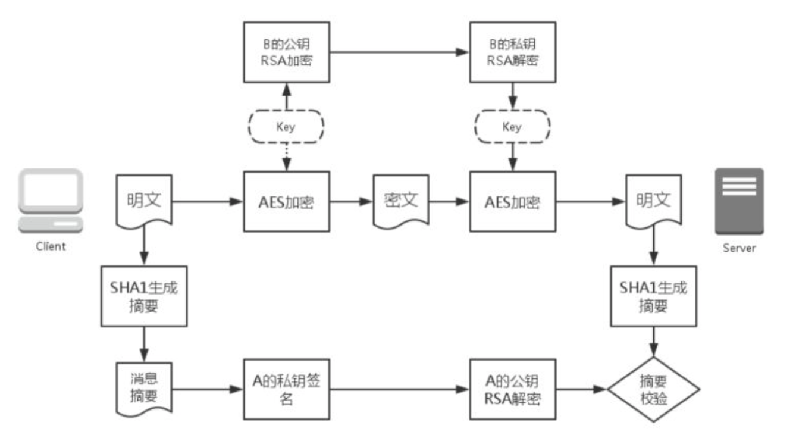

## Safe Communicate
### 用于演示简单的安全通信

### 用法

1. 在两台机器上分别部署server和client, utils.py两者都需要
2. client.py, A-private.pem, B-public.pem在机器A上
3. server.py, B-private.pem, A-public.pem在机器B上
4. 修改client.py中的HOST变量
5. B机器运行server.py
6. A机器运行client.py

### 说明

* A的私钥用来计算RSA签名
* B的私钥用来加密AES的key